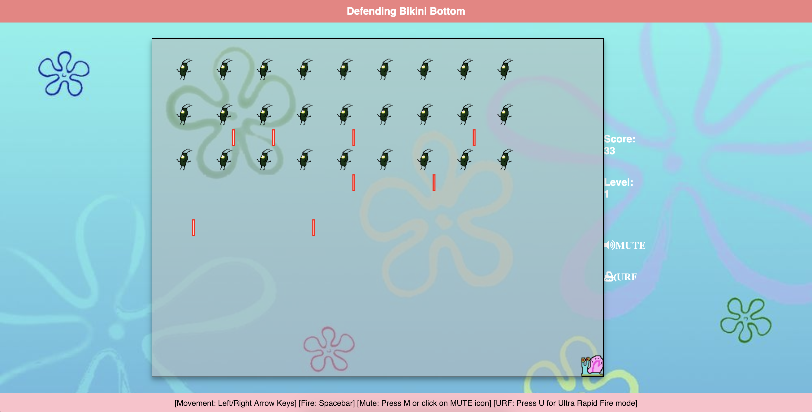
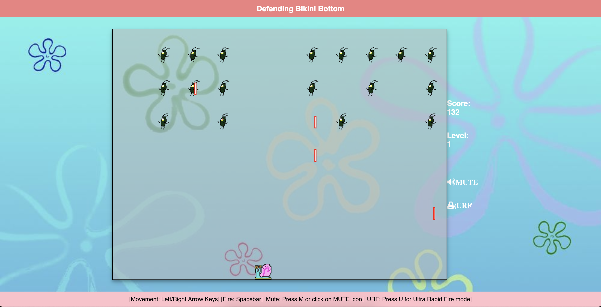
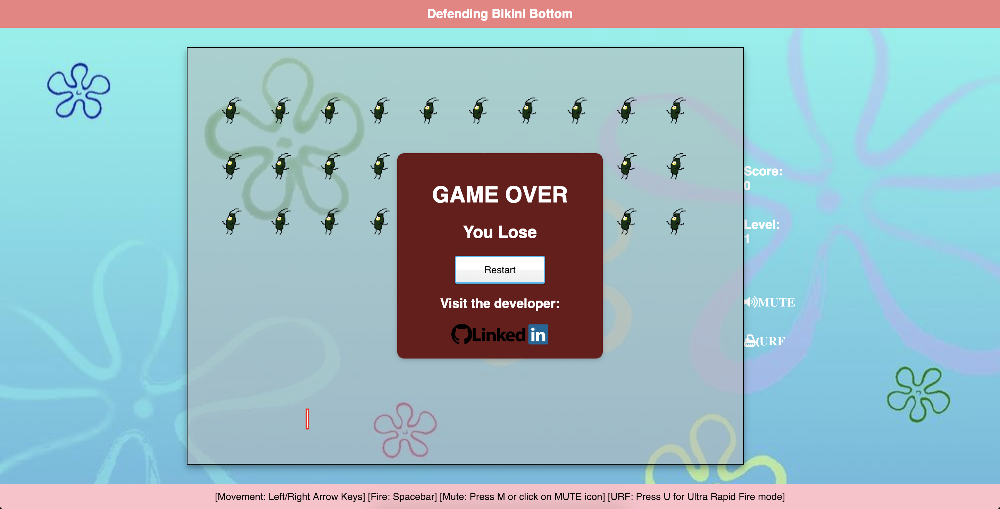
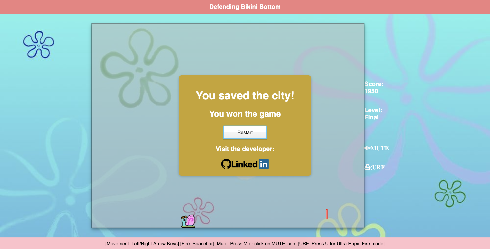

## Overview

Defending Bikini Bottom is a fun arcade game with simple and easy to use controls where a player moves Gary the Snail left to right along the bottom of the screen while attacking the enemy Planktons.

The game gets progressively harder as the Planktons fire faster at higher levels. [Play Here](https://jparriola.github.io/Defending-Bikini-Bottom/)

This game is inspired by a classic arcade game that I grew up playing called Space Invaders.

[Space Invaders](https://en.wikipedia.org/wiki/Space_Invaders)

### Functionality

* Users can press left/right arrow keys to move their sprite sideways along the bottom portion of the screen.
* The army of Planktons will move in circles on the page while firing lasers at the player.
* The game ends if the player gets hit by the enemy lasers.

### Wireframes

* Game will be played in a single window.

* Planktons disappear after when hit by Gary's lasers.

* If Gary is hit by one of Plankton's lasers, the game is over.

* After clearing all 5 levels, Gary has won the game!

##### Technologies employed

* Vanilla JavaScript for game logic.
* React.js for basic page structure and functionality.

### MVPs
- [X] Basic visuals and an interactive interface.
- [X] Player can move sprite side to side.
- [X] Planktons moving around on the window.
- [X] Laser collision for player and enemy Planktons.
- [X] Styling of game border and sprites.

### Development timeline

##### Day 1:
- [X] Finish brainstorming, concept, and proposal.
- [X] Finish basic project skeleton and essentials.

##### Day 2:
- [X] Review games from the instructional curriculum.
- [X] Complete basic page skeleton and functionality.
- [X] Basic board design and rendering.

##### Day 3:
- [X] Basic player Gary rendering and complete movement functionality.
- [X] Start firing mechanism for Gary and Planktons.

##### Day 4:
- [X] Start Plankton rendering and movement functionality.
- [X] Start game over condition.

##### Day 5:
- [X] Finish Plankton rendering and movement.
- [X] Complete game over condition.

##### Day 6:
- [X] Clean up any styling issues.
